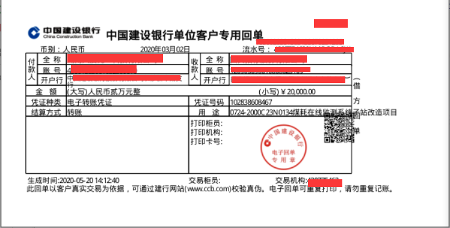
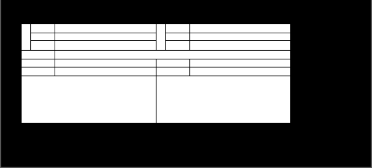
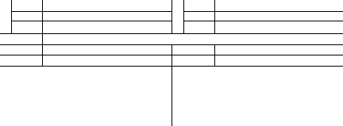
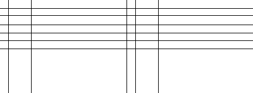
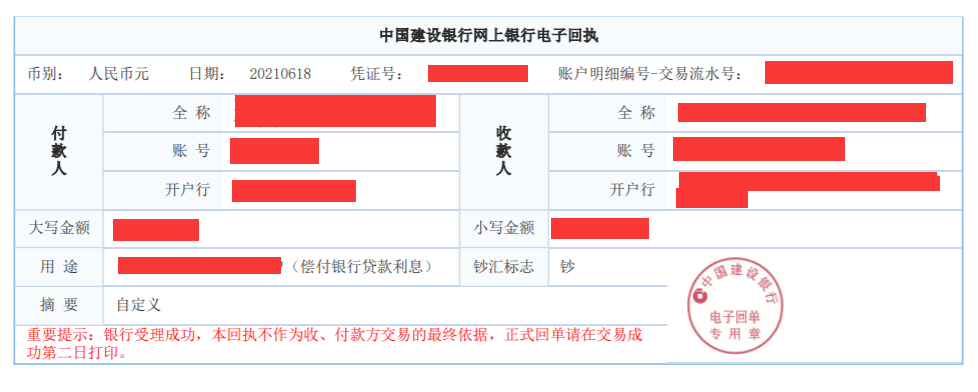
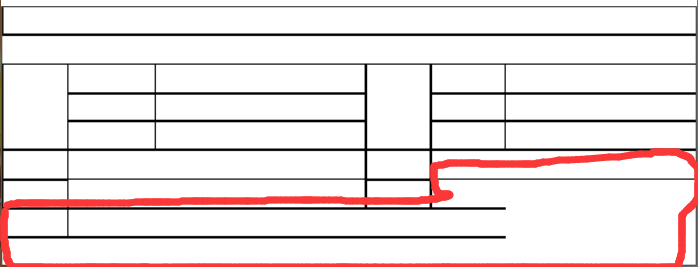
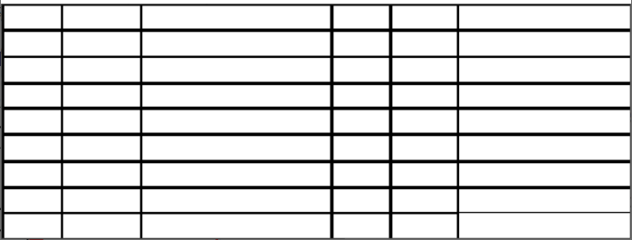

# 简介
  在开发RPA项目时，需要提取pdf表格内容，并保留表格格式。在网络中苦苦寻求多日，未能找到一份完全满足项目需求的开源库。最终采用pymupdf+cv2框架实现对pdf表格的提取。由pymupdf读取pdf（pumupdf还支持xps格式文件）内容，而cv2依据提出内容中的线条绘制并计算表格轮廓，最终找找到文本内容与表格对应关系。项目比较小众，代码也很零散，但希望能够帮助到恰好有需要的人。

  > In the RPA project, the content in pdf format needs to be extracted and the table format is retained. I have been struggling for many days in the network to find an open source library that fully meets the needs of the project. Finally, the pymupdf + cv2 framework is used to read the content of pdf from pymupdf (pumupdf also supports xps format files), and cv2 elaborates the drawing in the proposed content and calculates the table, and finally finds the relationship between the found content text and the table. There are many projects, and the code is very fragmented, but I hope to help those in need.

# 已知的开源框架
在项目中
1. tabula-py源码使用java实现，可以参考[tabula-java](https://github.com/tabulapdf/tabula-java "tabula")。提取PDF表格能力强悍，但在项目运行中偶尔出现一些异常
2. pdfplumber使用非常便捷，但部分pdf中的表格无法提取
3. camelot因为本人水平有限，pip安装过程中遇到一些问题，导致无法安装

# 项目依赖
 > python3  
 > PyMuPDF==1.19.1  
 > cv2==4.5.4

# 具体实现
由于已有的开源项目不能满足限制的项目，于是打算使用机器视觉的方式来提取表格相关的信息。大致处理流程如下：
1. 获取pdf的当前页文档的内容，例如文本，坐标等
2. 当前页的长宽，创建一块相同尺寸cv2的Mat画布
3. 获取当前页的所有线条，并在画布上绘制线条
4. 使用轮廓包围，查找到所有各自表格格子的矩形框坐标
5. 使用当前页的get_text_selection方法获取每个格子的文字信息
6. 延长表格线条，使其到达表格边缘，用于检测表格格子所占行列数量
7. 计算文字与表格对应关系，以及表格填充范围

## 注意部分
其中有几个需要注意的细节部分：
1. 可以创建一个单通道的画布，这样可以避免灰度化和二值化操作
2. 使用白底黑线，并使用漫水填充边缘，这样可以避免轮廓分析
3. 如果表格线条是双实线，可以用开闭运算去掉双实线
4. 使用get_text_selection方法时需要注意文本是否已经超出cell框的边界，如果超过边界，则只能获取到边框内的文字
5. 对于超过格子范围的文字，可以根据判断文字区域的中心坐标是否在cell中来提取文字。

## 实现步骤图
### 加载PDF

### 绘制表格线条

### 裁剪表格

### 线条延长

### 解析异常的表格
  
  

    
  
